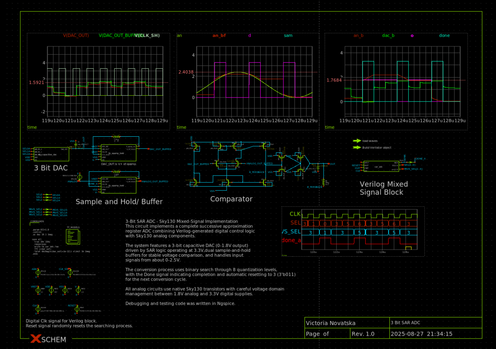
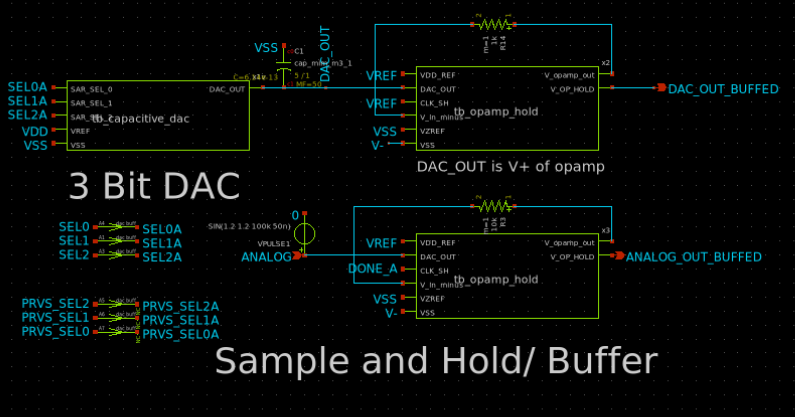
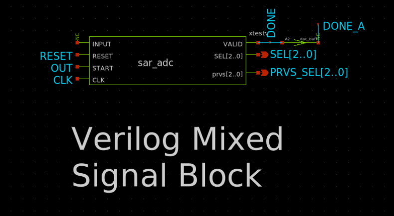
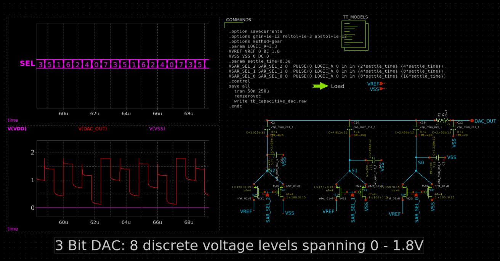
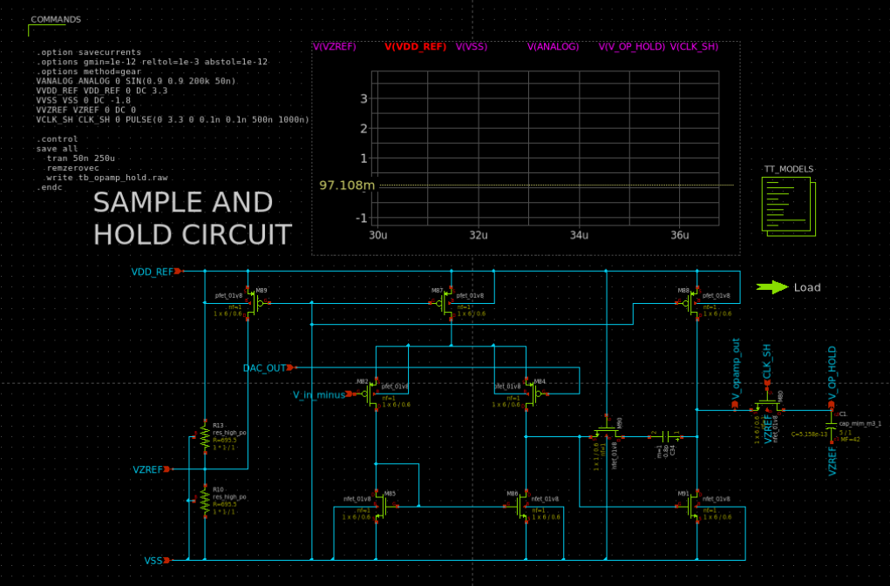
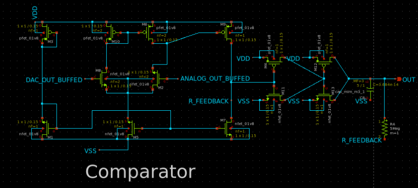

# 3-Bit SAR ADC Implementation

## Overview
This project implements a 3-bit Successive Approximation Register (SAR) Analog-to-Digital Converter using **Sky130 open-source PDK** components/spice models in Xschem. The design demonstrates real mixed-signal techniques by combining Verilog-generated digital control logic, generated using Verilator, with custom analog circuits, achieving a circular system

## Architecture
The SAR ADC employs a hybrid architecture that seamlessly bridges analog and digital domains:

- **Digital Control Logic**: Verilog-based SAR binary search algorithm compiled to SPICE using Verilator for precise timing control
- **Analog Signals**: Custom Sky130 transistor-level amplifier circuits
- **Cross-Domain Interface**: Uses a 1.8V and 3.3V for control logic and positive supply.



### Core Components

#### Binary-Weighted Capacitive DAC
- **Architecture**: 3-bit binary-weighted capacitor array using Sky130 MIM capacitors.
- The DAC circuit is controlled by 3 select lines, where each controls the first, second and third bit respectively.
For example: an input of 0 0 0 gives us the lowest voltage from the DAC, while a 1 1 1 gives us the highest voltage, at about 1.8V.



#### Dual Sample-and-Hold Architecture
- Two sample and hold circuits are used, one to sample the DAC output, and one to hold the analog input voltage.
- For the DAC output: which also acts as a buffer to prevent the DAC output being affected by input into the comparator.
- For the Analog Signal input: It must be sampled and held  long enough to make at least 3 clock cycles of comparisons to ensure comparison with a single analog voltage from which to make SAR logic decisions (and the next DAC outputs)


#### SAR Control Logic
- **Algorithm**: Implements binary search from midpoint (binary 3 = 011₂) for optimal convergence
- **Completion Signaling**: `Done` flag indicates conversion completion and triggers reset
- **Reset Behavior**: Automatic return to binary value 3 for next conversion cycle

### Comparator

<details>
  
<summary>Verilog Code</summary>
  
```verilog
    `timescale 100ns/100ns
    module three_bit_adc
    (
      output reg done,
      output reg [2:0] sel_wire,
      output reg [2:0] prvs_sel_wire,
      input wire clk,
      input wire reset,
      input wire add
    );
    reg [2:0] prvs_sel;  // Internal signal for simulator visibilityi
    reg [2:0] sel;
    reg reg_clk;
    reg reg_reset;
    reg reg_add;

    always@(*) begin
      prvs_sel_wire = prvs_sel;	
      done = (sel == 3'b000) | (sel == 3'b010) | (sel == 3'b100) | (sel == 3'b110 & !add) | (sel == 3'b111);
      sel_wire = sel;
    end
	  initial begin
      		$display("ADC sim start");
      		sel_wire = 0;
      		done = 0;
      		//$display("initial begin: add=%b prvs_sel=%03b sel=%03b reset=%b", add,prvs_sel,sel,reset); 
   	end
	  always @(posedge clk) begin
	
           //$display("after always begin: add=%b prvs_sel=%03b sel=%03b reset=%b", add,prvs_sel,sel,reset);
		if (reset | done) begin
    	    sel <= 3'b011;  // Reset to default value
           prvs_sel = 3'b011;
        end
        else begin
           prvs_sel = sel;  // Capture current sel value for reference
	   //$display("afterelse begin: add=%b prvs_sel=%03b sel=%03b reset=%b", add,prvs_sel,sel,reset);
	   if (add) begin // comparator told us that prvs sel guess was too low
                case (prvs_sel)
                    3'b000: sel <= 3'b000;
                    3'b001: sel <= 3'b010;
                    3'b010: sel <= 3'b010;           
                    3'b011: sel <= 3'b101;
                    3'b100: sel <= 3'b100;
                    3'b101: sel <= 3'b110;
                    3'b110: sel <= 3'b111;
                    3'b111: sel <= 3'b111;
                   // default: sel <= 3'b011;
                endcase
            end
            else begin // comp told us prvs sel guess was too high
                case (prvs_sel)
                    3'b000: sel <= 3'b000;
                    3'b001: sel <= 3'b000;
                    3'b010: sel <= 3'b010;
                    3'b011: sel <= 3'b001;
                    3'b100: sel <=3'b100;
                    3'b101: sel <= 3'b100;
                    3'b110: sel <= 3'b110;
                    3'b111: sel <= 3'b111;
                   // default: sel <= 3'b011;
                endcase
            end
        end
  	end
endmodule
```
</details>

## Technical Specifications

| Parameter | Value | Notes |
|-----------|-------|-------|
| **Resolution** | 3 bits | 8 voltage levels |
| **Digital Supply** | 3.3V | Control logic and interfaces |
| **Analog Supply** | 1.8V | DAC reference and analog frontend |
| **Analog Negative Supply** | -1.8V | This gave me good results to make it possible to sample near zero voltages |
| **Input Range** | 0V ~ 2.5V | Analog signal sampling capability |
| **DAC Range** | 0V - 1.8V | Reference voltage generation |
| **Conversion Method** | Binary search | Starting from midpoint 3 (3'b011), taking in OUT as signal to decide DAC output increase or decrease |

### Sky130 PDK Integration

### Prerequisites
I used this [Docker Image](https://github.com/iic-jku/IIC-OSIC-TOOLS/tree/main?tab=readme-ov-file). Unfortunately, I only discovered after a few hours of trying to install all the software and PDKs myself, which proved nearly impossible.
If you use this image, you should be able to get exactly the same file paths as I did when making this project.

### Running Simulations
1. Open the top-level tb_sar_adc.sch schematic in Xschem
2. Generate verilator object
3. Generate the netlist
4. Run the simulation

